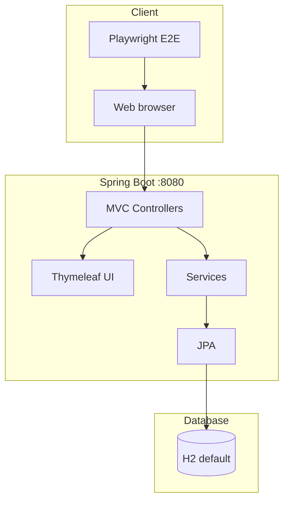

# Spring PetClinic (Chris at Cursor fork)

[](https://github.com/chrisatcursor/spring-petclinic/actions/workflows/gradle-build.yml)

A [Spring Boot](https://spring.io/guides/gs/spring-boot) sample veterinary clinic application, forked from [spring-projects/spring-petclinic](https://github.com/spring-projects/spring-petclinic) for modernization demos: Playwright E2E tests, REST API migration, and a planned React SPA.

**Full documentation:** [docs/](docs/README.md)

## Quick start

**Requirements:** Java 17+, Git. Node.js is only needed for E2E tests.

```bash
git clone https://github.com/chrisatcursor/spring-petclinic.git
cd spring-petclinic
./mvnw spring-boot:run
# or: ./gradlew bootRun
```

Open [http://localhost:8080](http://localhost:8080).

```bash
# Verify build
./gradlew build

# E2E tests (after npm install + playwright install)
npm install && npx playwright install --with-deps chromium
npm run test:e2e
```

See [Getting started](docs/getting-started.md) for databases, dev containers, and troubleshooting.

## What this fork adds

| Addition | Purpose |
|----------|---------|
| [`e2e/`](e2e/) | Playwright tests — UI contract for Thymeleaf and future React |
| [`docs/`](docs/) | Architecture, development, E2E, and migration guides |
| [`.cursor/`](.cursor/) | Agent skills, rules, and migration plans |
| Migration branches | `e2e-tests`, `migration/rest-api-*`, `migration/react-*` |

Related REST backend for React work: [chrisatcursor/spring-petclinic-rest](https://github.com/chrisatcursor/spring-petclinic-rest).

## Architecture



Planned evolution: JSON REST layer + React SPA in `frontend/`, validated by the same Playwright suite. Details: [Architecture](docs/architecture.md) · [Migration](docs/migration.md).

## Documentation

| Guide | Topics |
|-------|--------|
| [docs/README.md](docs/README.md) | Documentation index |
| [Getting started](docs/getting-started.md) | Install, run, verify |
| [Architecture](docs/architecture.md) | Layers, domain, diagrams |
| [Development](docs/development.md) | Build, DB, CSS, IDE, CI |
| [E2E testing](docs/e2e-testing.md) | Playwright contract and commands |
| [Migration](docs/migration.md) | REST + React tracks |
| [Contributing](docs/contributing.md) | Fork workflow, DCO, PRs |

## Application features

- Manage **owners**, **pets**, **visits**, and **veterinarians**
- Server-rendered UI (Thymeleaf + Bootstrap)
- H2 by default; MySQL and PostgreSQL via Spring profiles
- Internationalized messages (multiple `messages_*.properties` bundles)

## Build and run reference

| Task | Command |
|------|---------|
| Run (Maven) | `./mvnw spring-boot:run` |
| Run (Gradle) | `./gradlew bootRun` |
| Test | `./gradlew build` or `./mvnw verify` |
| E2E | `npm run test:e2e` |
| MySQL DB | `docker compose up mysql` + profile `mysql` |
| PostgreSQL | `docker compose up postgres` + profile `postgres` |

## Upstream reference

This fork tracks the canonical Spring PetClinic sample. For upstream-only topics (historical slides, community forks list), see [spring-projects/spring-petclinic](https://github.com/spring-projects/spring-petclinic).

**Contributing here:** use only `chrisatcursor/spring-petclinic` for remotes and pull request bases — see [Contributing](docs/contributing.md).

## License

Released under the [Apache License 2.0](LICENSE.txt).
