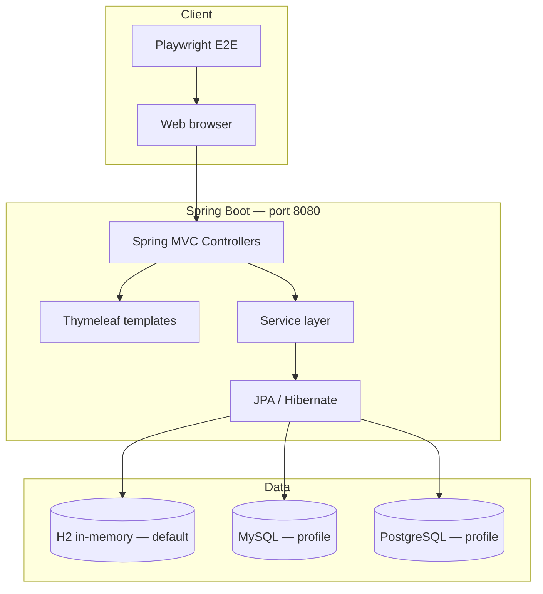
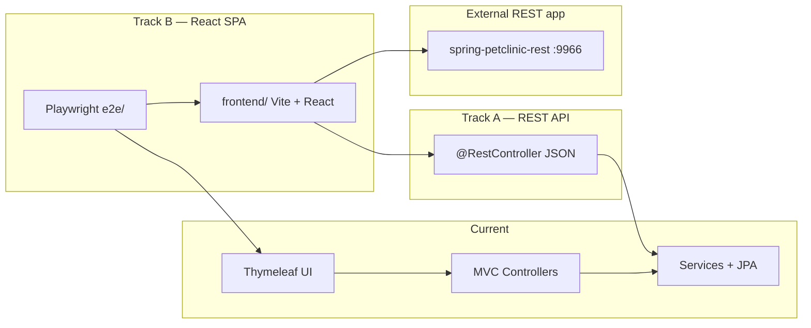

# Architecture

Spring PetClinic is a classic three-tier Spring Boot web application. The UI is server-rendered with Thymeleaf; business logic lives in services backed by JPA repositories and an embedded or external database.

## High-level overview

## Planned migration architecture

This fork is set up for a two-track modernization (see [Migration](migration.md)):

Track A adds JSON endpoints alongside existing Thymeleaf controllers. Track B replaces Thymeleaf with a React SPA that consumes `spring-petclinic-rest` (or Track A endpoints). Playwright tests validate both UIs against the same user-visible contract.

## Application layers

| Layer | Location | Responsibility |
|-------|----------|----------------|
| **Web** | `owner/`, `vet/`, `system/` controllers | HTTP routing, form binding, view selection |
| **View** | `src/main/resources/templates/` | Thymeleaf HTML, fragments, i18n |
| **Domain** | `model/`, entity packages | JPA entities (`Owner`, `Pet`, `Visit`, `Vet`, …) |
| **Persistence** | Spring Data JPA repositories | CRUD and queries |
| **Infrastructure** | `application.properties`, `db/` | Profiles, schema, seed data |

## Domain model

PetClinic models a veterinary clinic:

- **Owner** — person who owns one or more pets
- **Pet** — animal belonging to an owner (has a type: cat, dog, …)
- **Visit** — appointment record for a pet
- **Vet** — veterinarian, optionally with **Specialty** skills

Relationships are standard JPA associations (one-to-many, many-to-many). Validation uses Jakarta Bean Validation on entities and form objects.

## Controllers and routes

| Controller | Base paths | Purpose |
|------------|------------|---------|
| `WelcomeController` | `/` | Home page |
| `OwnerController` | `/owners/*` | Search, list, create, edit, detail |
| `PetController` | `/owners/{id}/pets/*` | Add and edit pets |
| `VisitController` | `/owners/{id}/pets/{petId}/visits/*` | Schedule visits |
| `VetController` | `/vets.html`, `/vets` | Vet list (HTML + JSON at `/vets`) |
| `CrashController` | `/oups` | Demo error page |

Full route inventory for React parity is in `.cursor/skills/react-migration/SKILL.md`.

## Technology stack

| Component | Version / choice |
|-----------|------------------|
| Java | 17+ (toolchain in `build.gradle`) |
| Spring Boot | 4.0.x |
| View | Thymeleaf + Bootstrap (WebJars) |
| Persistence | Spring Data JPA, Hibernate |
| Default DB | H2 in-memory |
| Optional DB | MySQL, PostgreSQL (Spring profiles) |
| Build | Gradle (CI) and Maven (wrapper scripts) |
| E2E | Playwright (`@playwright/test`) |

## Configuration

Key settings live in `src/main/resources/application.properties`:

- `database=h2` — selects `classpath:db/{database}/schema.sql` and `data.sql`
- Profiles: `spring.profiles.active=mysql` or `postgres` for persistent databases
- Actuator endpoints exposed for health and metrics

Profile-specific files: `application-mysql.properties`, `application-postgres.properties`.

## Static assets and styling

- Compiled CSS: `src/main/resources/static/resources/css/petclinic.css`
- Source SCSS: `src/main/scss/` (rebuild with Maven profile `css`; see [Development](development.md))

## Internationalization

Message bundles under `src/main/resources/messages/` support multiple locales (e.g. `messages_en.properties`, `messages_de.properties`). Templates use `#{...}` expressions for localized strings.
